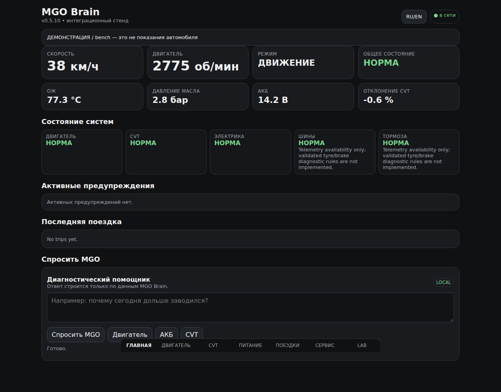

# MGO Brain

[](https://github.com/chup1runov/mgo-brain/actions/workflows/ci.yml)
[](https://github.com/chup1runov/mgo-brain/actions/workflows/audit.yml)
[](LICENSE)

**Experimental local telemetry, diagnostics and vehicle-observability platform for the Microcar M.Go / F8 0.5 with Progress ACT / Lombardini LDW502.**

> **Safety:** research/prototype software. It is not certified automotive diagnostic or safety equipment. It must not replace OEM warnings or become required for starting, braking, steering, D/N/R selection, speed-limiter operation, or other safety-critical functions.



## Features

- canonical signals with source quality, freshness and fallback;
- simulator and multi-source integration bench;
- deterministic local alerts and subsystem health;
- start/trip history with SQLite and optional Parquet/DuckDB analytics;
- passive CAN survey, recording, replay and numeric signal discovery;
- adapter boundaries for SocketCAN, DBC, Sensor CAN, Modbus, VE.Direct, TPMS and GNSS/IMU;
- Russian-first PWA dashboard with English fallback;
- read-only Ask MGO evidence gateway with local fallback and optional external AI;
- deployment, kiosk, backup and commissioning tooling.

The codebase does **not** prove that any particular signal exists on the real M.Go CAN bus. Real vehicle mappings remain hypotheses until measured and reproduced.

## Status

Current software release: **v0.5.11**.

Software tests, Docker smoke and real Chromium UI audits exist. Physical integration with the target vehicle has not yet been completed. Factory CAN pins/bitrate/DBC, sensor fitment, automotive power transients, sleep/wake behavior and diagnostic thresholds still require real measurements.

See the [roadmap](docs/ROADMAP.md), [current backlog](docs/REMAINING_WORK_RU.md), [safety model](docs/SAFETY.md), and [documentation index](docs/INDEX.md).

## Quick start

Python 3.11+:

```bash
git clone https://github.com/chup1runov/mgo-brain.git
cd mgo-brain
python3 -m venv .venv
source .venv/bin/activate
python -m pip install -e '.[dev,analytics]'
pytest -q
mgo-bench-smoke
MGO_BRAIN_SOURCES_FILE="$PWD/config/sources-bench.json" MGO_AI_PROVIDER=local mgo-brain
```

Open <http://127.0.0.1:8080/>.

A normal wheel install contains the default configuration and web assets; deployment environment variables can override them.

## Docker

```bash
docker build -t mgo-brain .
docker run --rm -p 127.0.0.1:8080:8080 mgo-brain
```

The container runs as a non-root user. Mount a persistent data volume for real use.

## Factory CAN boundary

Factory CAN commissioning is receive-only. MGO Brain exposes no factory-CAN transmit method, Linux SocketCAN LISTEN-ONLY is verified before physical factory-CAN use, and no pin/bitrate/ID/scale assumption is accepted without evidence.

See [Commissioning](docs/COMMISSIONING.md) and [CAN Survey Toolkit](docs/CAN_SURVEY.md).

## Network security

The service binds to `127.0.0.1` by default and is intended for a trusted local network. It does not currently implement authentication suitable for direct Internet exposure. Do not port-forward the API; use a closed LAN or authenticated VPN/reverse proxy for remote access.

## Privacy

Runtime telemetry, GPS tracks, SQLite/Parquet data, captures, credentials and deployment secrets are excluded from Git by policy. See [Data & Privacy](docs/DATA_PRIVACY.md).

## Documentation

- **Русская точка восстановления:** [START_HERE_RU.md](START_HERE_RU.md)
- [Architecture](docs/ARCHITECTURE.md)
- [Hardware BOM](docs/HARDWARE_BOM.md)
- [Integration bench](docs/BENCH.md)
- [Ask MGO](docs/AI_GATEWAY.md)
- [Testing](docs/TESTING.md)
- [Support](SUPPORT.md)
- [How to cite](CITATION.cff)
- [Public release policy](docs/PUBLIC_RELEASE.md)

## Contributing

Contributions are welcome, especially around CAN research, protocol adapters, failure-mode tests and documentation. Read [CONTRIBUTING.md](CONTRIBUTING.md) and [SECURITY.md](SECURITY.md).

Vehicle-specific claims must be marked as documented, observed, measured, confirmed or hypothesis.

## License

Apache License 2.0. See [LICENSE](LICENSE).

MGO Brain is an independent project and is not affiliated with the vehicle, engine or hardware vendors referenced in this repository.
